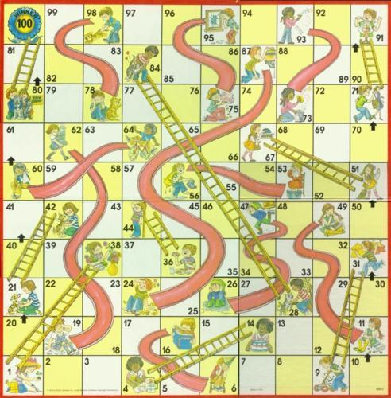

# chutes-and-ladders
An graph-based analysis of the game Chutes and Ladders

All the work is in the ipython notebook, [chutes_and_ladders.ipynb](chutes_and_ladders.ipynb).

It includes

* A graph representation of all possible turns on the board
* All of the best-possible solutions to the game (The fewest possible number of turns is 7.)
* The fewest number of turns to victory for each square on the board
* The mean number of turns until victory for each square on the board
